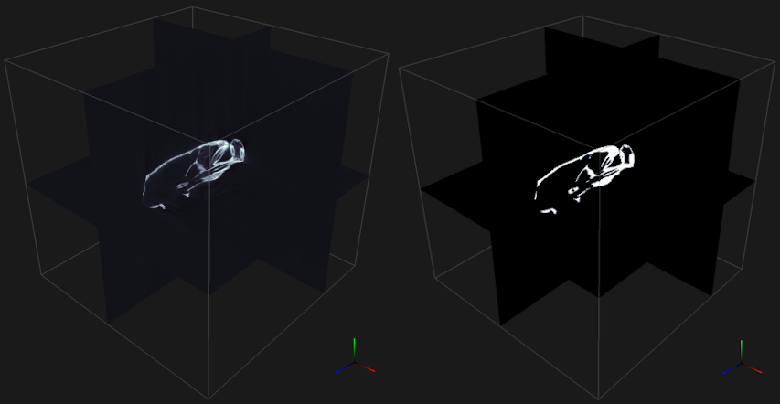

# Plugins

Plugins can perform post-processing on reconstructed slices.

## Developing a plugin

Developing a post-processing plugin is as easy as implementing a single Python
function that takes a 2D numpy array (the reconstructed slice), and returns a 2D
numpy array (the postprocessed slice). An example plugin looks like this.

```python
{! pages/users/otsu_plugin.py !}
```

This plugin listens to incoming `SliceData` packets on port `5652`, and connects
to a visualization software (or another plugin) listening on port `5555`. These
are the default values. If you use the standard `slicerecon_server` program,
connecting the Python plugin is as easy as passing `--pyplugin` as a flag.

This plugin computes a simple segmentation based on a threshold computed by [Otsu's method](https://en.wikipedia.org/wiki/Otsu%27s_method).

## Testing your plugin


1. Start RECAST3D:

```bash
recast3d
```

2. Start `slicerecon_server`, e.g.:

```bash
slicerecon_server --slice-size 512 --pyplugin
```

3. Run your plugin, e.g.:

```bash
python plugin.py
```

4. Stream projection data to the `slicerecon_server`, e.g.:

```bash
python slicerecon_push_flexdata.py [path_to_data] --sample 2
```

If you make a change to `plugin.py`, you can restart it without touching the other components (recast3d, slicerecon) and without restreaming the projection data. Simply request a new reconstruction by modifying a slice (e.g. by clicking on one of the slices in RECAST3D) to see the result.

## _Example_: Otsu thresholding

The example of above should give the following visual result.



Dataset: _A cone beam scan of a rat skull_: [10.5281/zenodo.1164088](https://doi.org/10.5281/zenodo.1164088)


